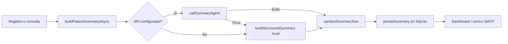

# Integracion del agente de resumen IA

Este documento describe como funciona el modulo de resumen clinico estructurado (`utils/ia.js`) y como conectarlo a un proveedor LLM externo.

## Objetivo

Al registrar o consultar el historial de un paciente, el sistema genera un **resumen estructurado en 6 secciones**, orientado a **terapia cognitivo-conductual (TCC)**:

1. **Intervenciones y fechas** — listado cronologico de sesiones.
2. **Criticidad** — nivel Baja, Moderada, Alta o Critica con justificacion breve.
3. **Datos importantes de sesiones anteriores** — hallazgos relevantes del historial previo.
4. **Datos importantes de la ultima sesion** — contenido clinico mas reciente.
5. **Avance entre sesiones** — comparacion de progreso entre la penultima y la ultima sesion.
6. **Enfoque TCC y temas de atencion** — pensamientos automaticos, conductas, regulacion emocional, tareas y adherencia.

## Flujo del agente



## Variables de entorno

| Variable | Obligatoria | Descripcion |
|----------|-------------|-------------|
| `AI_SUMMARY_API_URL` | No | Endpoint POST compatible con chat/completions |
| `AI_SUMMARY_API_KEY` | No | Token Bearer para autenticacion |
| `AI_SUMMARY_MODEL` | No | Modelo a usar (default: `qwen-plus`) |

Ejemplo con OpenAI:

```env
AI_SUMMARY_API_URL=https://api.openai.com/v1/chat/completions
AI_SUMMARY_API_KEY=sk-...
AI_SUMMARY_MODEL=gpt-4o-mini
```

## Contrato de la API

### Request

```http
POST {AI_SUMMARY_API_URL}
Authorization: Bearer {AI_SUMMARY_API_KEY}
Content-Type: application/json
```

```json
{
  "model": "gpt-4o-mini",
  "temperature": 0.2,
  "messages": [
    { "role": "system", "content": "..." },
    { "role": "user", "content": "Paciente: ... Registros: ..." }
  ]
}
```

El prompt de sistema incluye criterios TCC y exige las 6 secciones con encabezados `## 1.` a `## 6.`.

### Response (campos soportados)

El modulo extrae el texto del primer campo disponible:

- `choices[0].message.content` (OpenAI / Qwen)
- `summary`
- `text`
- `result`
- `output_text`

## Fallback local

Si la API no esta configurada o falla, `buildStructuredSummary` genera el mismo formato usando heuristica sobre los registros SQLite:

- Criticidad inferida por palabras clave clinicas en descripcion/observaciones.
- Ultima sesion vs anteriores separadas cronologicamente.
- Avance comparando las dos sesiones mas recientes.

## Puntos de integracion en la app

| Archivo | Uso |
|---------|-----|
| `utils/ia.js` | Agente LLM + fallback estructurado |
| `utils/summaryCache.js` | Cache en tabla `resumenes` |
| `routes/intervenciones.js` | Regenera resumen al guardar; envia correo |
| `routes/dashboard.js` | Muestra resumen en dashboard y vista paciente |
| `utils/mailer.js` | Incluye resumen en HTML del correo |

## Cache de resumenes

La tabla `resumenes` almacena el ultimo resumen por paciente. Se invalida al guardar una nueva intervencion y se regenera en la vista individual del paciente.

## Pruebas

```bash
npm test
```

Los tests en `tests/summary.test.js` validan las 6 secciones del fallback local.

## Consideraciones clinicas

- El resumen **apoya** la revision del caso; no reemplaza el criterio del terapeuta.
- No enviar datos sensibles a proveedores sin acuerdo institucional y cumplimiento normativo.
- Revisar periodicamente la calidad del prompt TCC segun el enfoque terapeutico de la fundacion.
